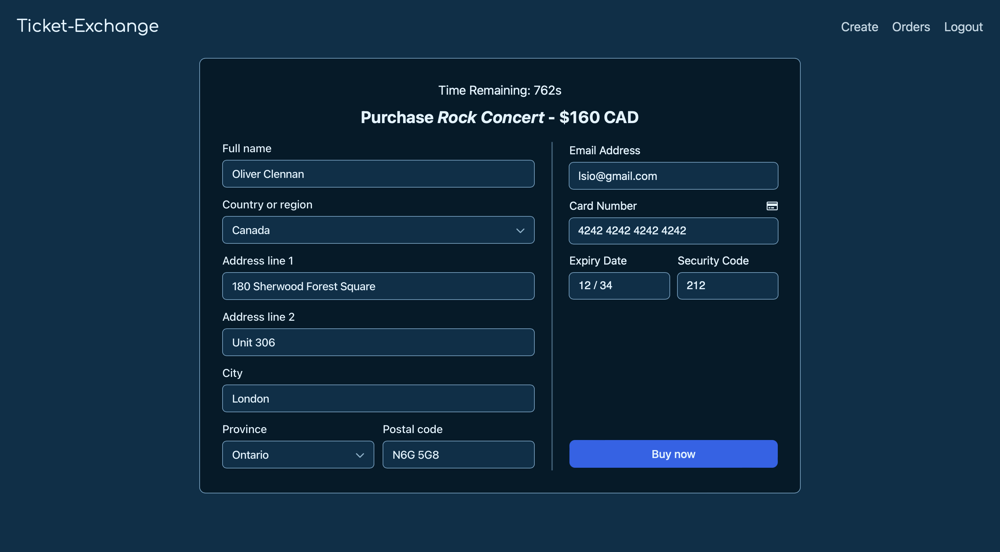
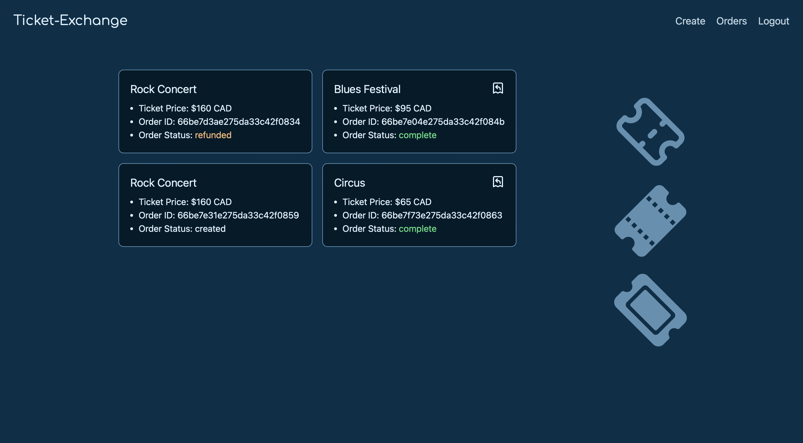
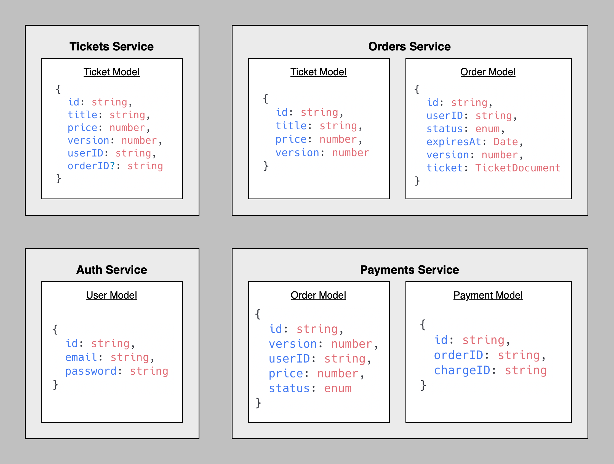

<h3> Ticket Exchange <a href="https:www.ticket-exchange.ca"> [https://www.ticket-exchange.ca] </a></h3>
<ul>
  <li></li>
</ul>

<h3> Core Workflow </h3>

<h3> User Authentication </h3>

<h3> Email Updates </h3>

<h3> Event-based Communication </h3>

<h3> Database Models </h3>

