# Ticket Exchange

   

## Overview

### Core Functionality
- A web application which facilitates the seamless buying and selling of tickets
- Users can create new listings, edit or delete existing listings, and purchase other users' listings
- Powered by six independent microservices, each running within a separate [Docker](https://www.docker.com) container
- Uses [MongoDB](https://www.mongodb.com) to securely store user account credentials, and maintain a comprehensive record of listings, orders, and payments
- Uses [NATS Streaming Server](https://nats.io) to implement asynchronous, event-based communication between services
- Uses [BullJS](https://www.npmjs.com/package/bull) and [Redis](https://redis.io) to implement delayed messaging (in particular, a 15-minute order expiration window)
- Uses [Resend](https://resend.com) to provide email updates; notifying users of significant events (e.g., order confirmation, order refunds)
- Uses [Stripe](https://stripe.com/en-ca) to implement secure checkout (i.e., collecting payment information server-side)
- Uses [Kubernetes](https://kubernetes.io) to manage - and facilitate interactions between - the containerized microservices
- This project was completed as part of the [Microservices with Node JS and React](https://www.udemy.com/share/102VKE3@7EmZCLfhgMS8nceqObqL-SLnUUwTL_cQ2PgLDvt3Djbb7731WxXdE-WuEC-NyENJTQ==/) course on Udemy

### UI Colour Palette

- Background (primary): `#003049` 
- Background (secondary): `#001B29` 
- Font: `#E0F4FF` 
- Outline: `#669BBC` 

## Core Workflow

### Create, Edit, and Delete Listings

- Authenticated users are redirected to the landing page, which displays all currently available listings
  - On this page, users are able to edit or delete their listings (but not other users' listings)
- Authenticated users can create listings by clicking on the "Create" link and filling out the subsequent form

### Purchase a Listing (Ticket)

- Clicking on a listing brings up a new page containing the listing details - users can click "Purchase" to initiate the checkout process
- Users are then shown the checkout page, where they have 15 minutes to enter their billing address and payment information to secure the listing
  - Note: if the user fails to complete the checkout stage in this 15-minute window, the order expires, and the ticket is released back into the public marketplace
- If the purchase is successful, the user is shown a new page which displays a brief summary of the order
  - Additionally, the user is sent an email containing all significant order information (see [Email Updates](#email-updates))
- Clicking "View Orders" directs the user to a new page presenting a comprehensive order history

### [Optional] Refund an Order
- If desired, users can request a complete refund for any of their prior orders by clicking the icon on the top-right of the corresponding order card
  - Note: partial refunds (i.e., refunds less than 100% of the original amount) are not supported at this time
- If the refund was successful, the user will receive a notification by email (see [Email Updates](#email-updates))

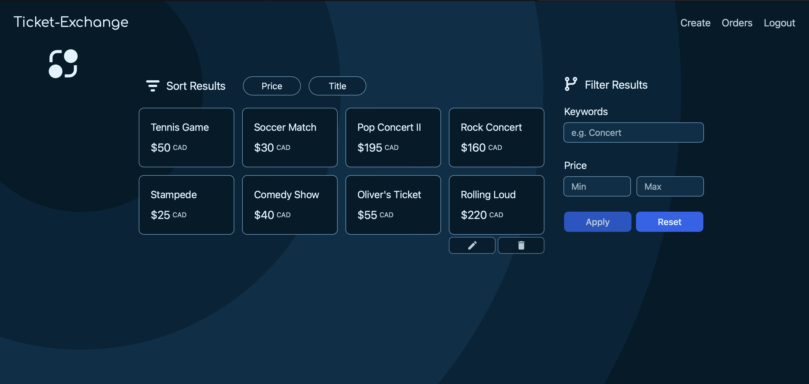
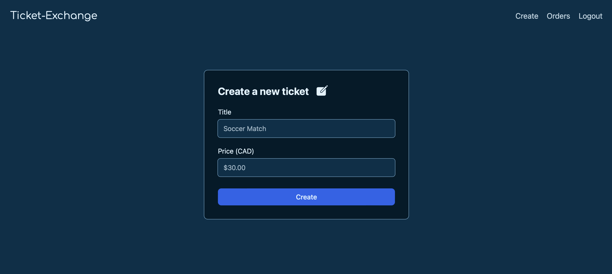
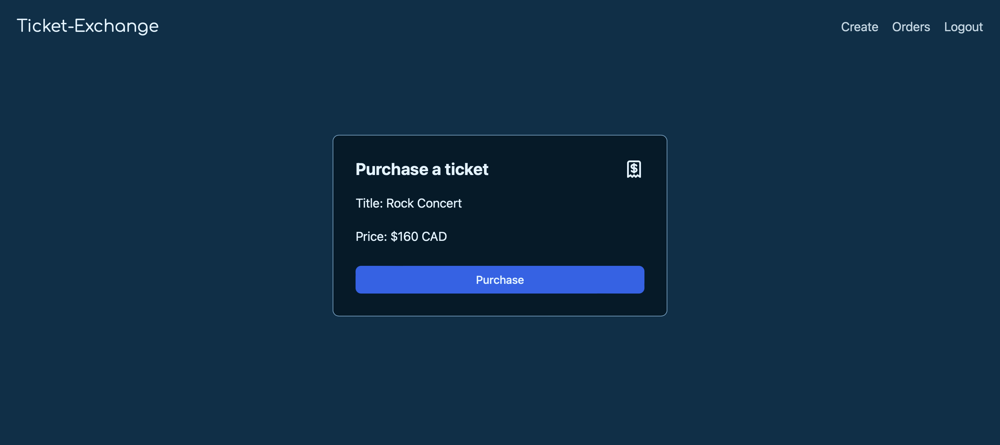
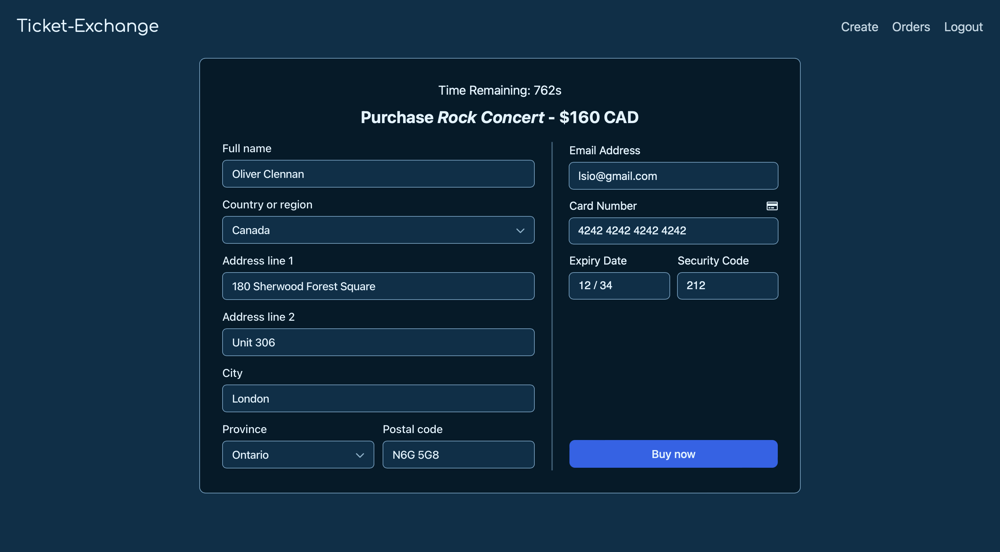
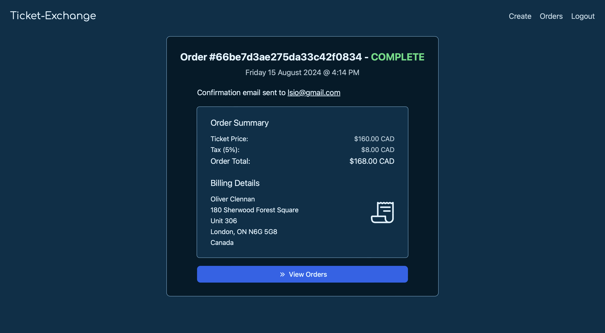
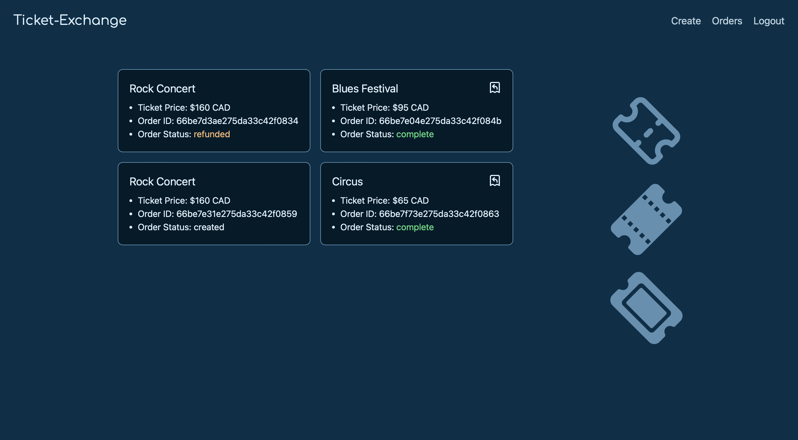

## User Authentication

Un-authenticated users are only able to view listings. Users must be authenticated in order to create, edit, delete, or purchase listings. Returning users can login to their existing accounts by providing valid credentials. New users must complete the registration form to create an account with the application (note: the supplied email address must be unique, i.e., it cannot be tied to another account in the system). Alternatively, users can choose to login/register through one of the supported third-party sign-in partners (at this time, only Google and GitHub are available).

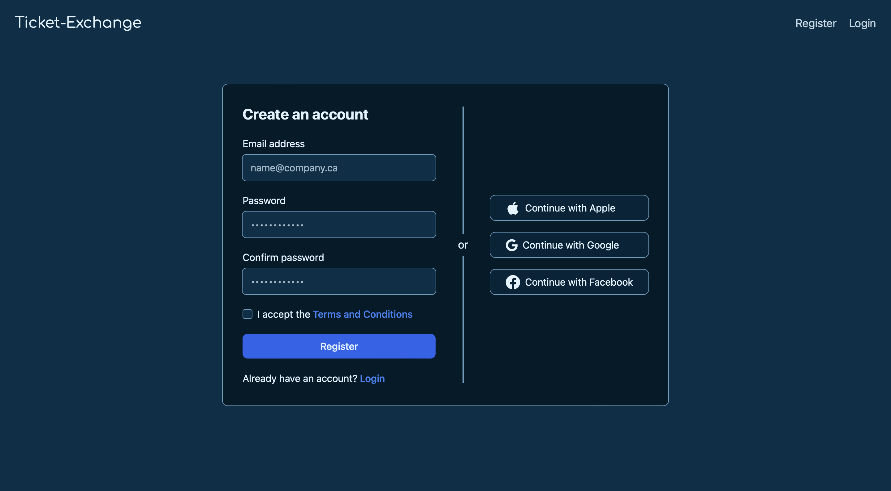
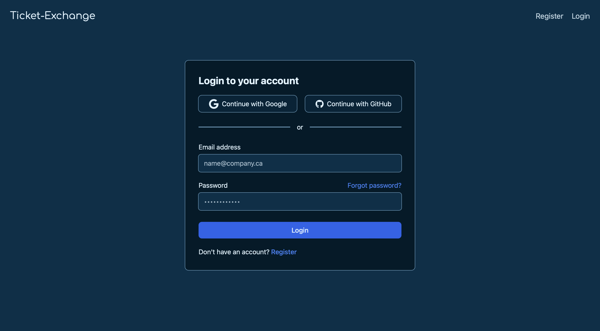

## Email Updates

Users will receive emails notifying them of significant events that occur within the [core application workflow](#core-workflow). Users will receive an order confirmation email (containing an order summary and billing details) once an order has been successfully processed. Additionally, users will receive an email notifying them of successful order refunds. The image below provides an example of the order confirmation email (on the left) and the order refund email (on the right).

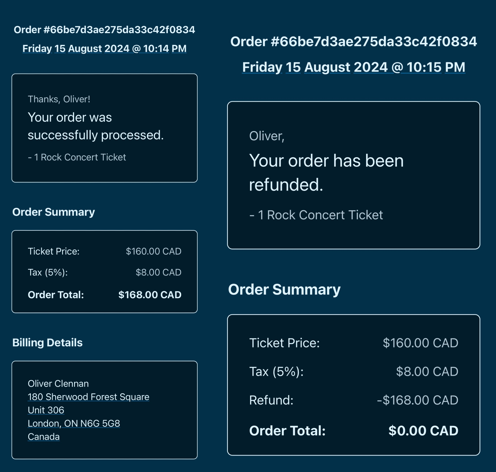

## Event-based Communication

Backend microservices communicate with each other in an asynchronous, event-based fashion. Publishers emit events, and subscribers consume events from their subscriptions (i.e., the channels which they are subscribed to). Queue groups are used to avoid the redundant emission of events to copies of the same service. The following diagram illustrates the flow of events through the event bus.

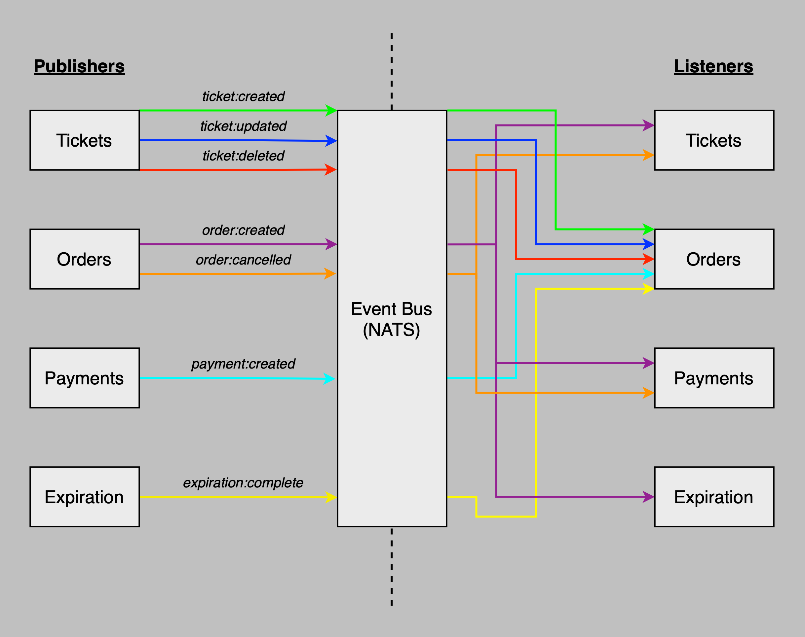

## Database Models

The following diagram displays the database schema for the models present in each microservice. In order to ensure the services are entirely self-contained (i.e., decoupled), there is some duplication of data within the application. For example, information regarding tickets is stored within both the tickets and orders services. Whenever the orders service requires ticket information (e.g., order creation, which requires a reference to an existing ticket document), it can directly access the ticket from within its own ticket model - effectively circumventing the need for asynchronous communication. In some services, optimistic concurrency control is implemented via a [Mongoose plugin](https://www.npmjs.com/package/mongoose-update-if-current) which increments the version number field whenever a document is modified (to prevent out-of-order updates).

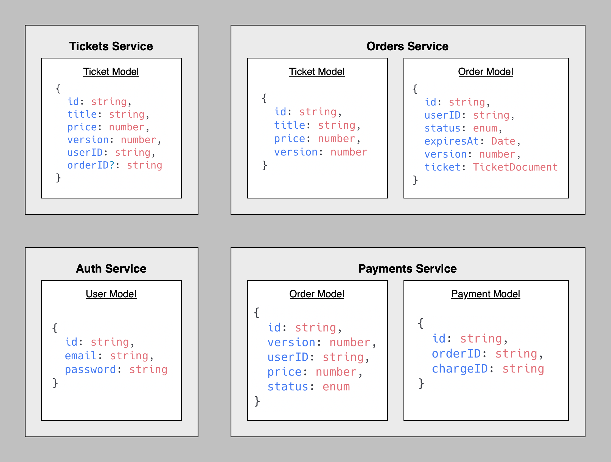

## Data Persistence

### Kubernetes

[StatefulSets](https://kubernetes.io/docs/concepts/workloads/controllers/statefulset/) are utilized to achieve data persistence across all services - in both production, and development environments. In each StatefulSet, a Persistent Volume Claim (PVC) is defined; requesting access to some amount of [Persistent Volume (PV)](https://kubernetes.io/docs/concepts/storage/persistent-volumes/) storage. PVs exist beyond the lifecycle of any individual pod, allowing data to persist in the case of pod/deployment restarts, and/or unexpected server failures. 

_Note:_ [MongoDB Atlas Clusters](https://www.mongodb.com/resources/products/fundamentals/clusters) could also be utilized to achieve data persistence (instead of relying upon StatefulSets and PVCs).

### Redis

[Redis Database (RDB)](https://redis.io/docs/latest/operate/oss_and_stack/management/persistence/#snapshotting) persistence is configured to save point-in-time snapshots of the Redis instance to the disk after each significant event in the expiration workflow (i.e., whenever the state of the BullJS queue changes). Additionally, [Redis Append-Only File (AOF)](https://redis.io/docs/latest/operate/oss_and_stack/management/persistence/#append-only-file) persistence is enabled; maintaining a comprehensive log of all write operations received by the Redis server.

### NATS

Currently, NATS Streaming Server is used to manage the transmission of events between microservices. By default, NATS Streaming Server operates entirely in-memory - eliminating the possibility of data persistence. In the future, I plan on investigating the viability of a migration to the newer [NATS Jetstream](https://docs.nats.io/nats-concepts/jetstream) module, which (in conjunction with Kubernetes PVs) could be used to successfully persist events/messages beyond the lifetime of any consumer.

## Testing

Backend microservices are thoroughly tested using [Supertest](https://www.npmjs.com/package/supertest) and [Jest](https://www.npmjs.com/package/jest). All backend components (routes, data models, event listeners/publishers) are targeted to ensure comprehensive test coverage.

## CI/CD

CI/CD is implemented via [GitHub Actions](https://docs.github.com/en/actions/writing-workflows). Whenever a pull request is created (attempting to merge a secondary branch with the main branch), all affected code will be tested automatically (by executing the relevant test suites). For example, if a pull request is created, and only the _orders_ service has been modified, then all tests related to the _orders_ service (and only those tests!) will be executed to ensure it is still functioning as expected after the recent changes. Additionally, whenever a pull request is accepted (i.e., code is pushed into the main branch), new Docker images will be created (to reflect the recent changes), and the affected deployments will be restarted.
