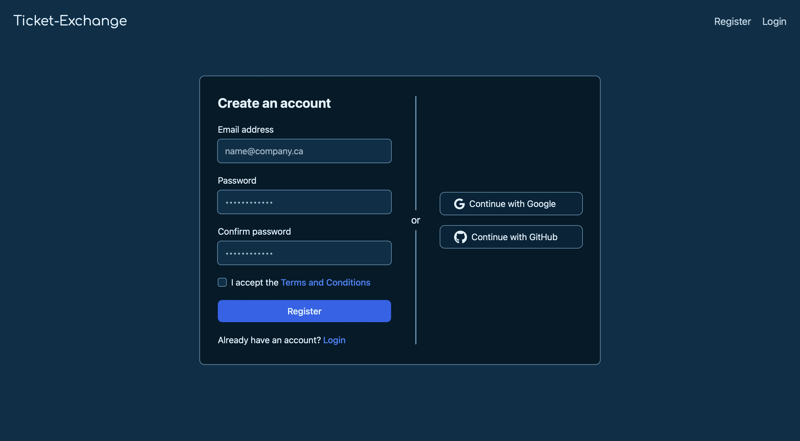

# Ticket Exchange <a href="https://www.ticket-exchange.ca"> [https://www.ticket-exchange.ca] </a>

### Overview
- A web application which facilitates the seamless buying and selling of tickets
- Users can create new listings, edit or delete existing listings, and purchase other users' listings
- Powered by six independent microservices (detailed in Event-based Communication)
- Uses **MongoDB** to securely store user account credentials, and maintain a comprehensive record of listings, orders, and payments
- Uses **NATS Streaming Server** to implement asynchronous, event-based communication between services
- Uses **BullJS** and **Redis** to implement delayed messaging (in particular, a 15-minute order expiration window)

### UI Colour Palette

- Background (primary): `#003049`
- Background (secondary): `#001B29`
- Font: `#E0F4FF`
- Outline: `#669BBC`

## Core Workflow

## User Authentication

## Email Updates

## Event-based Communication

## Database Models

## Data Persistence

### Redis

### NATS Streaming Server

### Kubernetes
